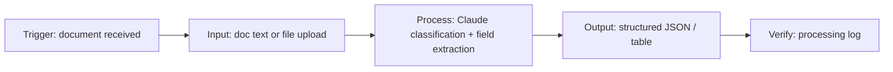

# Pipeline Workflow

- **Trigger** — a document arrives (sample selection or user upload in this demo;
  in production this could be an inbox, a folder watcher, or an upstream webhook).
- **Input** — raw document text is normalized and handed to the pipeline.
- **Process** — Claude classifies the document type and extracts the fields relevant
  to that type (invoice line items, contract terms, intake form details, etc.).
- **Output** — structured JSON is rendered as a table/JSON view with a confidence
  score and summary.
- **Verify** — every step is recorded in the processing log so a human can audit what
  happened and why, before the output is routed downstream.
